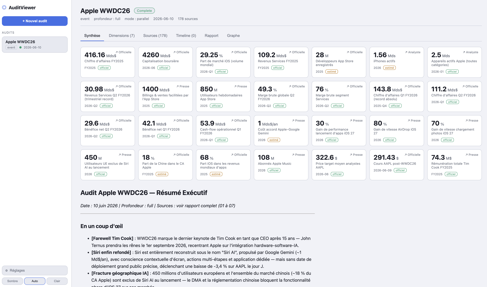
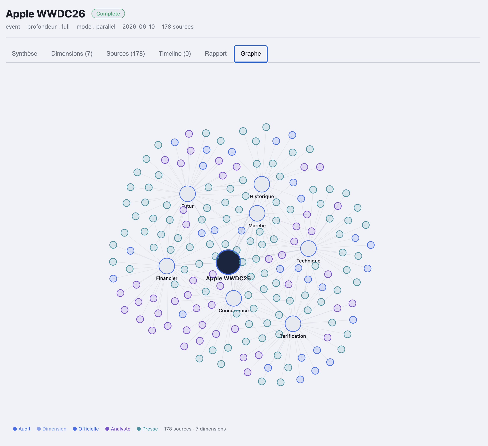
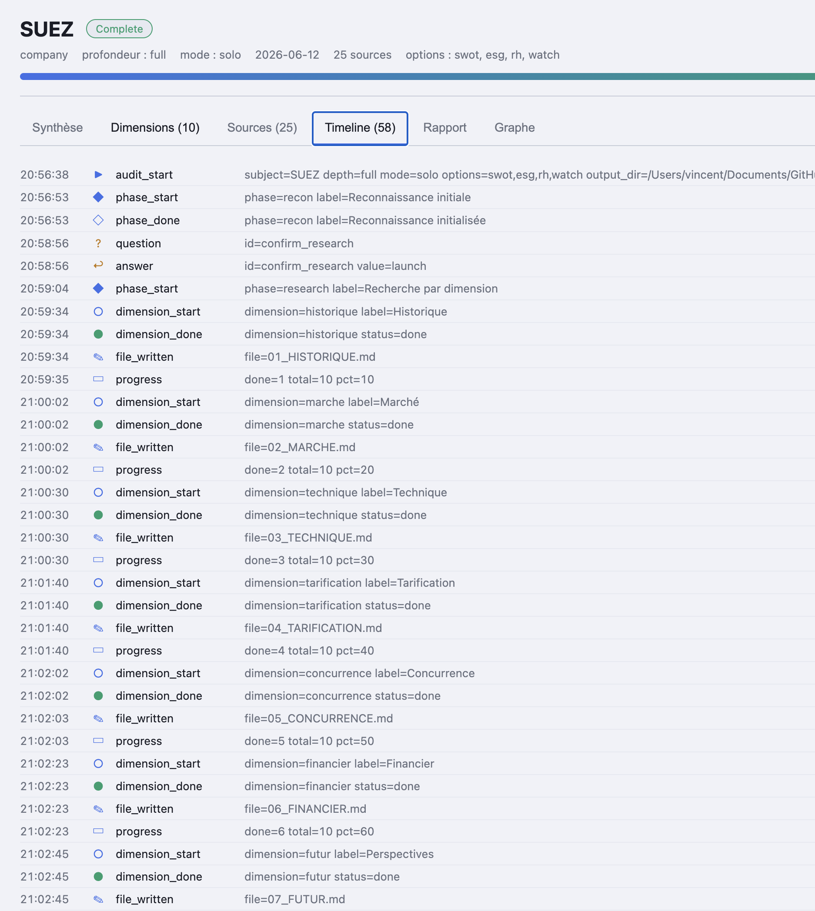
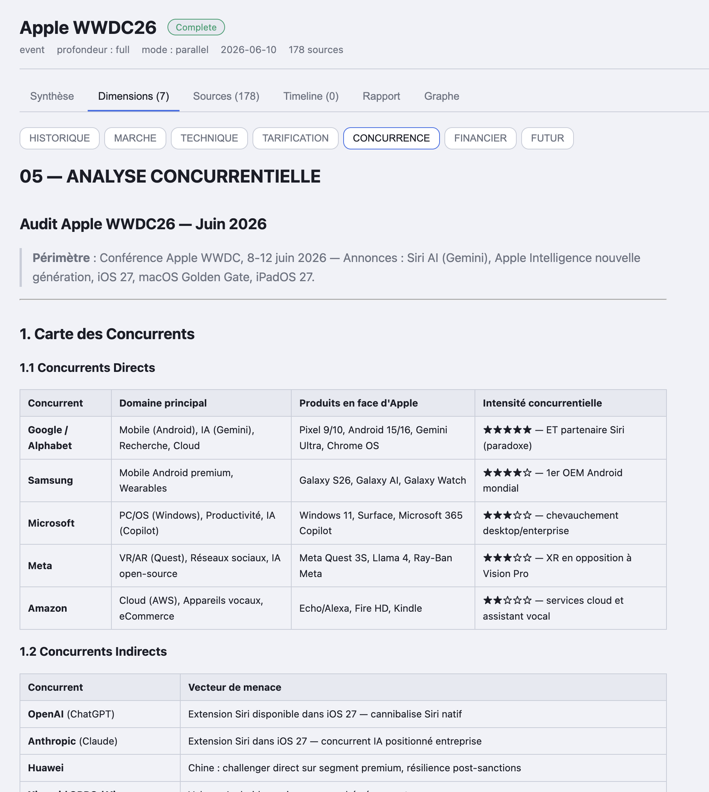
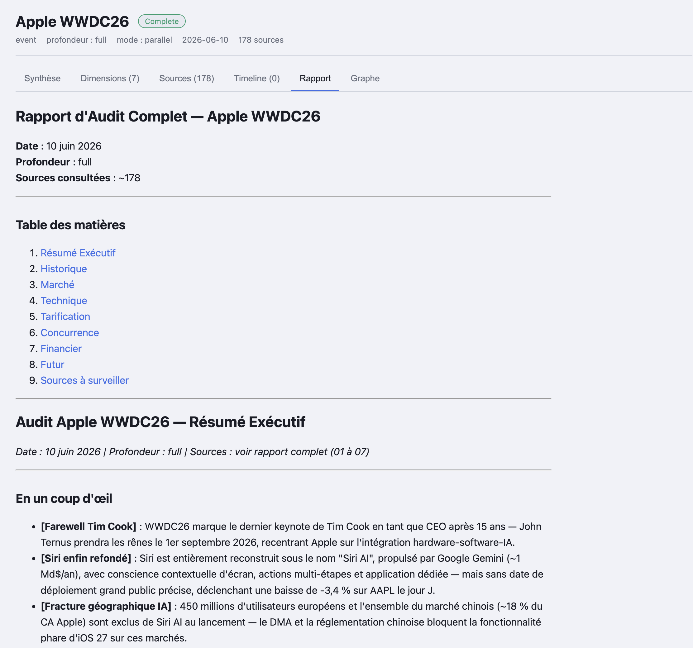
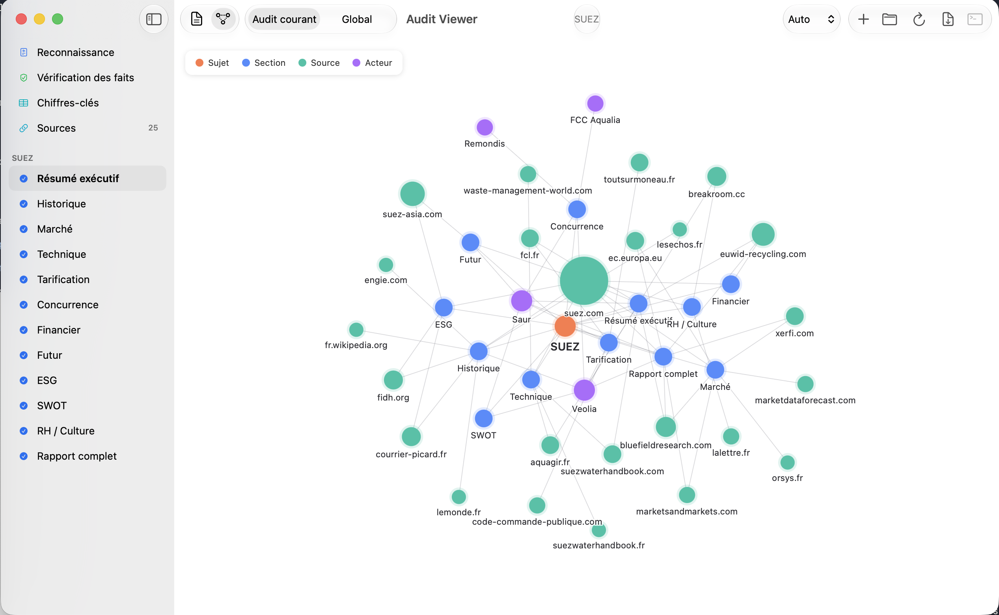
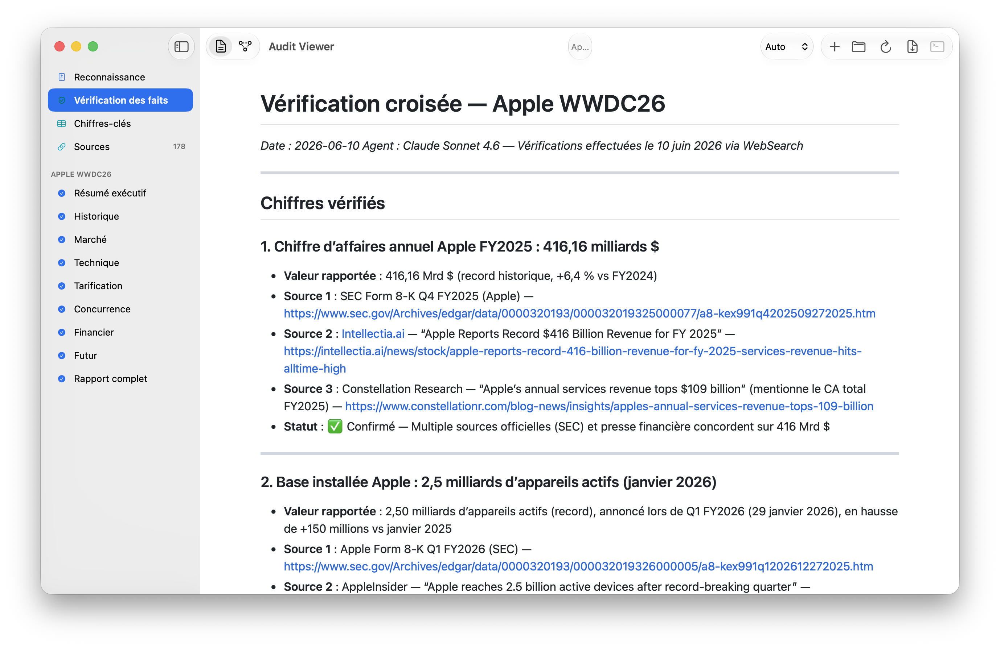
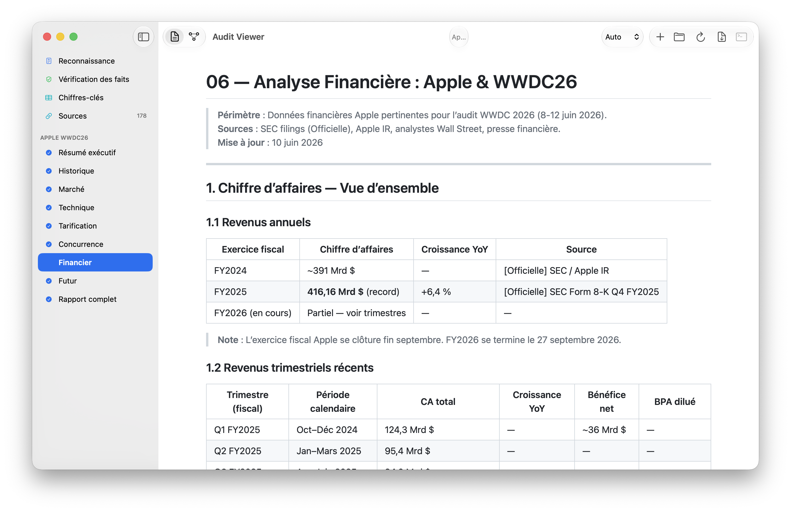
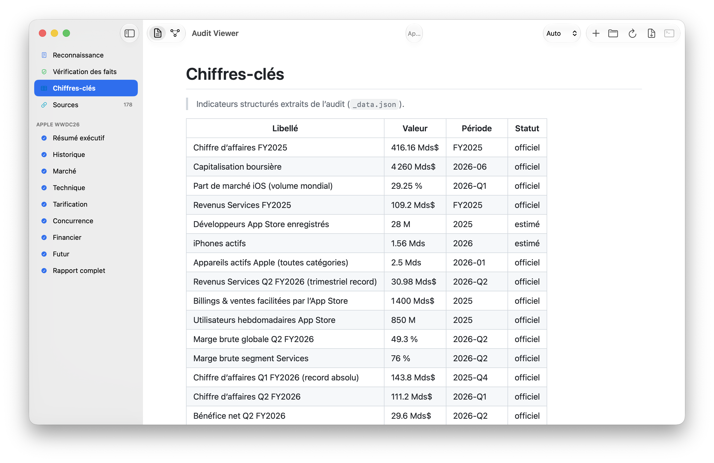

<p align="center">
  
</p>

# AuditViewer

**Transformez n'importe quelle entreprise, produit, marché ou technologie en un dossier stratégique complet — en quelques minutes, avec une seule ligne.**

*🇬🇧 [Read this README in English](README.md)*

[](LICENSE)


---

Vous tapez un nom — `Tesla`, `Notion`, `le marché des LLM`, `Société Générale`. Quelques minutes plus tard, vous avez un dossier de recherche structuré, sourcé et vérifié — l'équivalent de ce qu'un cabinet de conseil facturerait plusieurs milliers d'euros : historique, taille du marché, technologie, tarification, concurrence, données financières, perspectives — chaque chiffre adossé à une source datée.

AuditViewer est **un assistant IA de recherche stratégique** composé de trois briques qui fonctionnent ensemble :

| Brique | Ce que c'est | Pour qui |
|---|---|---|
| 🧠 **Skill `audit-report`** | Le moteur. Une commande qui lance la recherche et rédige un dossier complet. | Tout utilisateur de Claude Code ou Gemini |
| 🌐 **Visualiseur web** | Une application web pour lancer, suivre et lire les audits en direct. | Les utilisateurs qui préfèrent une interface web |
| 🖥️ **Application macOS** | Une application native Mac pour lire, comparer et explorer les audits sous forme de carte de connaissance. | Les utilisateurs de Mac |


> 🤝 **Compatible Claude Code *et* Gemini — sans verrouillage.** Le skill détecte automatiquement votre assistant : recherche multi-agents en parallèle sur Claude, mode « solo » à contexte unique sur Gemini. Le même rapport, dans les deux cas.

---

## Pourquoi ça existe

Bien chercher une entreprise ou un marché, c'est du travail lent et répétitif : des dizaines de recherches, vérifier les chiffres, parcourir les documents officiels, démêler le fait de la hype, puis assembler tout ça en quelque chose de lisible. AuditViewer fait ce travail pour vous et vous remet un **document prêt à la décision**, pas une pile d'onglets ouverts.

C'est bâti sur un principe : **chaque chiffre est sourcé et daté.** L'IA a l'instruction explicite de ne jamais inventer de données, d’étiqueter chaque source comme *Officielle / Analyste / Presse*, de signaler les données de plus d'un an, et de croiser les chiffres clés avec au moins deux sources indépendantes.

## Ce que vous obtenez vraiment

Lancez une commande et vous récupérez un dossier de documents prêts à lire :

| Fichier | Ce qu'il contient |
|---|---|
| **Résumé exécutif** | Une page : faits clés, chiffres phares, verdict |
| **Historique** | Origines, étapes clés, pivots, acquisitions, controverses |
| **Marché** | Taille (TAM/SAM/SOM), croissance, géographie, réglementation |
| **Technologie** | Produit, architecture, fonctionnalités, différentiateurs, brevets |
| **Tarification** | Niveaux de prix, modèle économique, comparaison sectorielle |
| **Concurrence** | Carte concurrentielle, parts de marché, positionnement, SWOT |
| **Données financières** | Chiffre d'affaires, financement, valorisation, indicateurs clés |
| **Perspectives** | Feuille de route, signaux faibles, risques, scénarios |
| **Rapport complet** | Tout fusionné en un document paginé et partageable |

Les options supplémentaires vous permettent de générer une **analyse SWOT** dédiée, un chapitre **ESG / durabilité**, un chapitre **RH & culture**, ou un **brief** d'une page.

👉 Voir un exemple concret et une visite guidée dans le **[guide de démarrage](docs/fr/demarrage.md)**.

## Aperçu



<table>
  <tr>
    <td width="50%"><br><sub><b>Carte façon Obsidian</b> — le sujet, ses dimensions et ~180 sources, reliés.</sub></td>
    <td width="50%"><br><sub><b>Timeline en direct</b> — suivez un audit, événement par événement.</sub></td>
  </tr>
  <tr>
    <td><br><sub><b>Vue par dimension</b> — analyse structurée (ici, le paysage concurrentiel).</sub></td>
    <td><br><sub><b>Rapport complet</b> — assemblé, prêt à lire ou partager.</sub></td>
  </tr>
</table>

> Vue : le visualiseur web. Les mêmes audits s'ouvrent dans l'[application macOS native](mac/README.md).

## Pour qui

- **Décideurs et analystes** — due diligence avant un investissement, surveillance concurrentielle, études de marché. Obtenez en minutes ce qui prend normalement des jours de recherche. → [Cas d'usage](docs/fr/cas-usage.md)
- **Curieux non-experts** — comprendre une entreprise, un produit ou un secteur sans se perdre dans le jargon. Les rapports se lisent comme un briefing, pas comme un tableau.
- **Développeurs et contributeurs** — le skill parle un [contrat machine](ARCHITECTURE.md) documenté et versionné, donc vous pouvez construire vos propres outils dessus.

---

## Comment ça marche, en trois étapes

1. **Vous demandez.** `/audit-report Tesla` — en optant éventuellement pour la profondeur, la langue et des chapitres supplémentaires.
2. **L'IA enquête.** Elle fait une reconnaissance rapide, confirme le périmètre avec vous, puis enquête sur chaque dimension en parallèle, fact-checke les chiffres clés, et assemble le rapport.
3. **Vous lisez et explorez.** Ouvrez le dossier directement, ou utilisez le visualiseur web / l'app Mac pour suivre la progression en direct, parcourir les chapitres et voir comment les audits se connectent.

Une explication plus approfondie, toujours non-technique, se trouve dans **[Comment ça marche](docs/fr/fonctionnement.md)**.

---

## Démarrage rapide

> Vous découvrez ? Commencez par le **[guide de démarrage](docs/fr/demarrage.md)** — il ne suppose aucun bagage technique.

### 1 — Le skill `audit-report` (le moteur)

Nécessite [Claude Code](https://claude.com/claude-code) ou Gemini.

```bash
./install.sh            # installer pour Claude Code (~/.claude/skills)
./install.sh --gemini   # installer pour Gemini (~/.gemini/config/skills)
./install.sh --copy     # copier au lieu de créer un lien symbolique
```

Puis, dans votre assistant IA :

```bash
/audit-report Apple
/audit-report "Tesla Model Y"
/audit-report "le marché des LLM" --lang fr
/audit-report Notion --depth quick
```

Référence : [`skills/audit-report/SKILL.md`](skills/audit-report/SKILL.md).

### 2 — Le visualiseur web

Nécessite [Node.js](https://nodejs.org/).

```bash
cd web
npm install
npm run dev    # backend sur :3001, frontend sur :5173 → ouvrir http://localhost:5173
```

Par défaut, le visualiseur lit les audits depuis `~/Documents/Research`. Pointez ailleurs avec `AUDITS_ROOT` :

```bash
AUDITS_ROOT=/chemin/vers/vos/audits npm run dev
```

Détails : [`web/README.md`](web/README.md).

### 3 — L'application macOS

[](https://github.com/vincentlauriat/AuditViewer/releases/latest)

**[Téléchargez le `.dmg` signé](https://github.com/vincentlauriat/AuditViewer/releases/latest)** — notarisé par Apple, avec mises à jour automatiques (Sparkle). Glissez-le dans Applications, c'est prêt.

<table>
  <tr>
    <td width="50%"><br><sub><b>Carte de connaissance native</b> — sujet, sections, sources et acteurs clés.</sub></td>
    <td width="50%"><br><sub><b>Vérification des faits</b> — chiffres clés recoupés avec des sources indépendantes.</sub></td>
  </tr>
  <tr>
    <td><br><sub><b>Markdown natif</b> — rendu riche avec tableaux et sections.</sub></td>
    <td><br><sub><b>Chiffres clés</b> — données structurées extraites de l'audit.</sub></td>
  </tr>
</table>

Ou compilez depuis les sources (macOS 15+, chaîne d'outils Swift) :

```bash
cd mac
./build.sh
open build/AuditViewer.app
```

Détails : [`mac/README.md`](mac/README.md).

---

## Documentation

| Guide | Pour |
|---|---|
| [Démarrage](docs/fr/demarrage.md) | Votre premier audit, pas à pas — sans jargon |
| [Cas d'usage](docs/fr/cas-usage.md) | Scénarios concrets par métier |
| [Comment ça marche](docs/fr/fonctionnement.md) | Les concepts en langage simple |
| [FAQ](docs/fr/faq.md) | Questions fréquentes |
| [Glossaire](docs/fr/glossaire.md) | Chaque terme technique expliqué |
| [Architecture](ARCHITECTURE.md) | Le contrat machine, pour les développeurs |

Les versions anglaises se trouvent sous [`docs/`](docs/).

---

## Sous le capot : le contrat machine

Les trois applications restent synchronisées parce que le skill écrit sa sortie comme un **"contrat machine" déterministe et versionné (v1)** : un flux d'événements en temps réel (`_events.jsonl`), un canal de contrôle bidirectionnel (`_control.json`), un cycle questions/réponses interactif, et des sorties structurées canoniques (`_manifest.json`, `_data.json`, `_sources.json`). Tout outil qui lit ce contrat peut afficher ou piloter un audit.


Spécification complète : [ARCHITECTURE.md](ARCHITECTURE.md).

### Disposition du dépôt

| Dossier | Rôle |
|---|---|
| `skills/audit-report/` | Le skill d'audit IA (Claude Code / Gemini) |
| `web/` | Visualiseur web et interface de contrôle (Node + React) |
| `mac/` | Application native macOS (SwiftUI) |
| `docs/` | Documentation utilisateur (cet ensemble de guides) |
| `images/` | Illustrations utilisées dans la documentation |

### Multi-plateforme

Le même contrat machine tourne partout ; seul le moteur d'exécution interne change.

| Plateforme | Mode recommandé | Mécanisme |
|---|---|---|
| **Claude Code** | `parallel` ou `sequential` | Orchestration multi-agent |
| **Gemini / Antigravity** | `solo` | Exécution à grand contexte unique |

---

## Licence

[MIT](LICENSE) © 2026 Vincent Lauriat.
