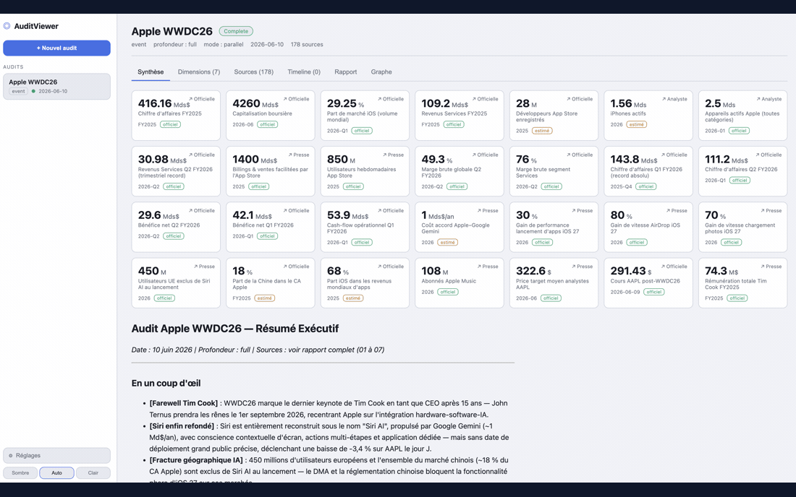

<p align="center">
  
</p>

# AuditViewer

**Turn any company, product, market or technology into a complete strategic dossier — in minutes, with one line.**

*🇫🇷 [Lire ce README en français](README.fr.md)*

[](https://vincentlauriat.github.io/AuditViewer/)
[](https://github.com/vincentlauriat/AuditViewer/releases/latest)
[](https://github.com/vincentlauriat/AuditViewer/releases)
[](https://github.com/vincentlauriat/AuditViewer/stargazers)
[](LICENSE)
[](https://github.com/vincentlauriat/AuditViewer/commits)
<br>


---

You type a name — `Tesla`, `Notion`, `the LLM market`, `Société Générale`. A few minutes later you have a structured, sourced, fact-checked research dossier worth what a consulting firm would bill thousands for: history, market sizing, technology, pricing, competition, financials, outlook — each figure backed by a dated source.

AuditViewer is **an AI strategic-research assistant** made of five parts that work together:

| Part | What it is | For whom |
|---|---|---|
| 🧠 **`audit-report` skill** | The engine. One command that researches a topic and writes a full dossier. | Anyone with Claude Code or Gemini |
| 🌐 **Web viewer** | A browser app to launch, watch, and read audits live. | Users who prefer a web UI |
| 🖥️ **macOS app** | A native Mac app to read, compare and explore audits as a knowledge map. | Mac users |
| 📱 **iOS / iPadOS app** | A native reader to browse your audits on iPhone & iPad, straight from the Files app. | Mobile readers |
| 📺 **Apple TV app** | A native reader to view your audits on the big screen, served over your local network. | Boardrooms & presentations |


> 🤝 **Works with Claude Code *and* Gemini — no lock-in.** The skill auto-detects your assistant: multi-agent parallel research on Claude, single-context "solo" mode on Gemini. Same report, either way.

---

## Why it exists

Researching a company or a market properly is slow, repetitive work: dozens of searches, cross-checking numbers, chasing official filings, separating fact from hype, then assembling it all into something readable. AuditViewer does that legwork for you and hands back a **decision-ready document**, not a pile of browser tabs.

It is built around one principle: **every number is sourced and dated.** The AI is explicitly instructed never to invent figures, to tag each source as *Official / Analyst / Press*, to flag data older than a year, and to cross-check the key numbers against at least two independent sources.

## What you actually get

Run one command and you get a folder of ready-to-read documents:

| File | What's inside |
|---|---|
| **Executive summary** | One page: key facts, headline figures, verdict |
| **History** | Origins, milestones, pivots, acquisitions, controversies |
| **Market** | Market size (TAM/SAM/SOM), growth, geography, regulation |
| **Technology** | Product, architecture, features, differentiators, patents |
| **Pricing** | Price tiers, business model, sector comparison |
| **Competition** | Competitive map, market shares, positioning, SWOT |
| **Financials** | Revenue, funding, valuation, key metrics |
| **Outlook** | Roadmap, weak signals, risks, scenarios |
| **Full report** | Everything merged into one paginated, shareable document |

Optional add-ons let you generate a dedicated **SWOT**, an **ESG / sustainability** chapter, an **HR & culture** chapter, or a single-page **brief**.

👉 See a real example and a guided walkthrough in **[the getting-started guide](docs/getting-started.md)**.

## See it in action



<table>
  <tr>
    <td width="50%"><br><sub><b>Obsidian-style map</b> — the subject, its dimensions and ~180 sources, linked.</sub></td>
    <td width="50%"><br><sub><b>Live timeline</b> — watch an audit run, event by event.</sub></td>
  </tr>
  <tr>
    <td><br><sub><b>Dimension view</b> — structured analysis (here, the competitive landscape).</sub></td>
    <td><br><sub><b>Full report</b> — assembled, ready to read or share.</sub></td>
  </tr>
</table>

> Shown: the web viewer. The same audits open in the [native macOS app](mac/README.md).

## Who it's for

- **Decision-makers & analysts** — due diligence before an investment, competitive monitoring, market studies. Get in minutes what normally takes days of desk research. → [Use cases](docs/use-cases.md)
- **Curious non-experts** — understand a company, a product or an industry without wading through jargon. The reports read like a briefing, not a spreadsheet.
- **Developers & contributors** — the skill speaks a documented, versioned [machine contract](ARCHITECTURE.md) so you can build your own tools on top of it.

---

## How it works, in three steps

1. **You ask.** `/audit-report Tesla` — optionally choosing depth, language, and extra chapters.
2. **The AI investigates.** It does a quick reconnaissance, confirms the scope with you, then researches each dimension in parallel, fact-checks the key numbers, and assembles the report.
3. **You read & explore.** Open the folder directly, or use the web viewer / Mac app to follow progress live, browse chapters, and see how audits connect to each other.

A deeper, still-non-technical explanation lives in **[How it works](docs/how-it-works.md)**.

---

## Quick start

> New to this? Start with the **[getting-started guide](docs/getting-started.md)** — it assumes no technical background.

### 1 — The `audit-report` skill (the engine)

Requires [Claude Code](https://claude.com/claude-code) or Gemini.

**Option A — from Claude Code (recommended), via the plugin marketplace:**

```bash
/plugin marketplace add vincentlauriat/toolkit
/plugin install audit-report@vincentlauriat-toolkit
```

**Option B — from the cloned repo, via the install script:**

```bash
./install.sh            # install for Claude Code (~/.claude/skills)
./install.sh --gemini   # install for Gemini (~/.gemini/config/skills)
./install.sh --copy     # copy instead of symlink
```

Then, inside your AI assistant:

```bash
/audit-report Apple
/audit-report "Tesla Model Y"
/audit-report "le marché des LLM" --lang fr
/audit-report Notion --depth quick
```

Reference: [`skills/audit-report/SKILL.md`](skills/audit-report/SKILL.md).

### 2 — The web viewer

Requires [Node.js](https://nodejs.org/).

```bash
cd web
npm install
npm run dev    # backend on :3001, frontend on :5173 → open http://localhost:5173
```

By default the viewer reads audits from `~/Documents/Research`. Point it elsewhere with `AUDITS_ROOT`:

```bash
AUDITS_ROOT=/path/to/your/audits npm run dev
```

Details: [`web/README.md`](web/README.md).

### 3 — The macOS app

[](https://github.com/vincentlauriat/AuditViewer/releases/latest)

**[Download the latest signed `.dmg`](https://github.com/vincentlauriat/AuditViewer/releases/latest)** — notarized by Apple, auto-updating (Sparkle). Drag it to Applications and you're done.

<table>
  <tr>
    <td width="50%"><br><sub><b>Native knowledge map</b> — subject, sections, sources and key people.</sub></td>
    <td width="50%"><br><sub><b>Fact-check</b> — key figures re-verified against independent sources.</sub></td>
  </tr>
  <tr>
    <td><br><sub><b>Native Markdown</b> — rich rendering with tables and sections.</sub></td>
    <td><br><sub><b>Key figures</b> — structured data extracted from the audit.</sub></td>
  </tr>
</table>

Or build from source (macOS 15+, Swift toolchain):

```bash
cd mac
./build.sh
open build/AuditViewer.app
```

Details: [`mac/README.md`](mac/README.md).

### 4 — The iOS / iPadOS app

A native **read-only reader** for iPhone & iPad: browse your audits and read each
dimension and the full Markdown report on the go. It opens your existing `Research`
folder straight from the **Files** app (iCloud Drive or "On My iPhone") — pick the
folder once and the app remembers it.

Build from source (iOS 17+, Xcode + [XcodeGen](https://github.com/yonaskolb/XcodeGen)):

```bash
cd mac
xcodegen generate
xcodebuild -scheme AuditViewerIOS -destination 'generic/platform=iOS Simulator' build
```

Scope is read-only — launching audits and the link map stay on Mac/Web. Sources live
under [`mac/ios/`](mac/ios/).

### 5 — The Apple TV app

A native **read-only reader** for Apple TV: view your audits on the big screen —
in meetings, presentations, the boardroom. It shows the audit list, the summary
(title, status, KPIs, badges), dimensions (drill-down), sources and the full
Markdown report, with native SwiftUI rendering and Siri Remote navigation.

Since tvOS has no file picker, no iCloud Drive and no persistent local storage, the
**Mac shares its `Research` folder over your local network**: the macOS app exposes a
small read-only HTTP server published via Bonjour (`_auditviewer._tcp`). Turn on
**"Share on local network"** in the Mac app (off by default), and the Apple TV
discovers the Mac automatically and reads the audits over a REST API. Everything stays
on the LAN — no cloud.

Build from source (tvOS 17+, Xcode + [XcodeGen](https://github.com/yonaskolb/XcodeGen)):

```bash
cd mac
xcodegen generate
./tvos/build.sh           # build & run on the tvOS Simulator
./tvos/build.sh <UDID>    # or target an Apple TV paired to Xcode over Wi-Fi
```

Scope is read-only — launching audits and the link map stay on Mac/Web. Sources live
under [`mac/tvos/`](mac/tvos/).

---

## Documentation

| Guide | For |
|---|---|
| [Getting started](docs/getting-started.md) | Your first audit, step by step — no jargon |
| [Use cases](docs/use-cases.md) | Concrete scenarios by profession |
| [How it works](docs/how-it-works.md) | The concepts, in plain language |
| [FAQ](docs/faq.md) | Common questions answered |
| [Glossary](docs/glossary.md) | Every technical term, demystified |
| [Architecture](ARCHITECTURE.md) | The machine contract, for developers |

French versions live under [`docs/fr/`](docs/fr/).

---

## Under the hood: the machine contract

The viewers stay in sync because the skill writes its output as a **deterministic, versioned "machine contract" (v1)**: a real-time event stream (`_events.jsonl`), a two-way control channel (`_control.json`), an interactive question/answer cycle, and canonical structured outputs (`_manifest.json`, `_data.json`, `_sources.json`). Any tool that reads this contract can display or drive an audit.


Full specification: [ARCHITECTURE.md](ARCHITECTURE.md).

### Repository layout

| Folder | Role |
|---|---|
| `skills/audit-report/` | The AI audit skill (Claude Code / Gemini) |
| `web/` | Web viewer & control UI (Node + React) |
| `mac/` | Native macOS app (SwiftUI) |
| `mac/ios/` | Native iOS / iPadOS reader app (SwiftUI) |
| `mac/tvos/` | Native Apple TV (tvOS) reader app (SwiftUI) |
| `docs/` | User documentation (this guide set) |
| `images/` | Illustrations used in the docs |

### Cross-platform

The same machine contract runs everywhere; only the internal execution engine differs.

| Platform | Recommended mode | Mechanism |
|---|---|---|
| **Claude Code** | `parallel` or `sequential` | Multi-agent orchestration |
| **Gemini / Antigravity** | `solo` | Single large-context run |

---

## License

[MIT](LICENSE) © 2026 Vincent Lauriat.
